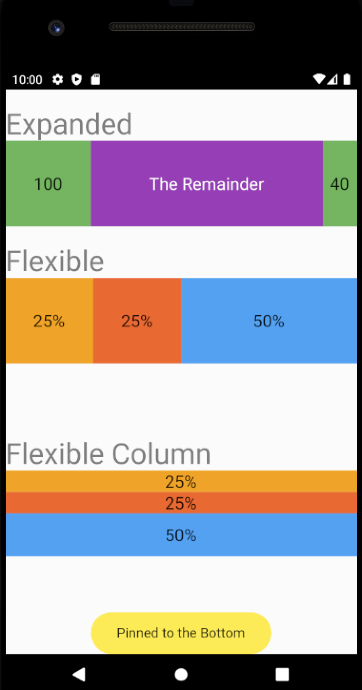

# simple_sample_1

Ejemplo de flex expanded and fleible containers.

Some examples are taken and modified from Flutter-Cookbook
https://www.amazon.com/Google-Flutter-Cookbook-techniques-development/dp/1838823387/ref=sr_1_1?dchild=1&keywords=Flutter-Cookbook&qid=1624981277&sr=8-1

